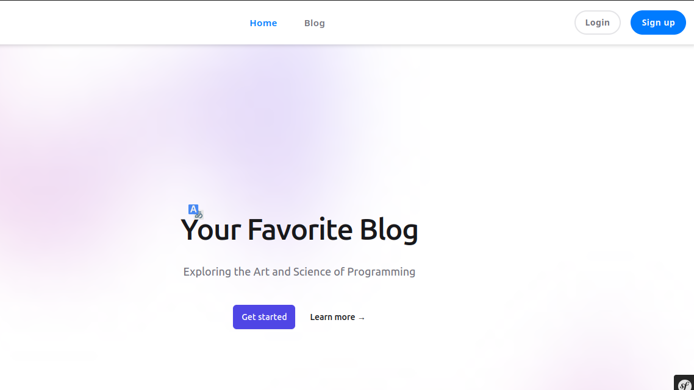
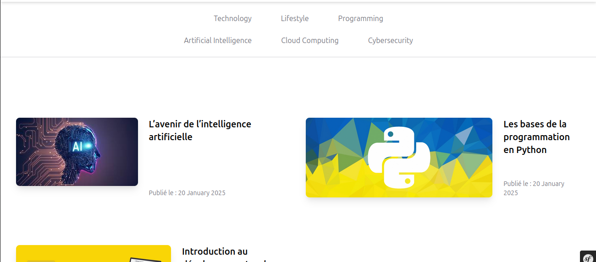

# Blog Platform

## Description
This is a blog platform built with Symfony, featuring categories, subcategories, and tags for organizing posts efficiently. Users can browse posts by category, explore subcategories, and filter content using tags.

## Features
- Categories and subcategories for structured content
- Tags for easy filtering of posts
- User-friendly interface
- SEO-friendly URLs

## Installation
1. Clone the repository:
   ```sh
   git clone https://github.com/200habib/Blog.git
   ```
2. Navigate to the project directory:
   ```sh
   cd blog-platform
   ```
3. Install dependencies using Composer:
   ```sh
   composer install
   ```
4. Set up the environment variables:
   ```sh
   cp .env.example .env
   ```
5. Generate the database schema:
   ```sh
   php bin/console doctrine:migrations:migrate
   ```
6. Start the Symfony server:
   ```sh
   symfony server:start
   ```

## Usage
- Navigate to the homepage to explore blog posts.
- Browse posts by categories and subcategories.
- Use tags to filter content and find relevant posts.

## Technologies Used
- Symfony
- PHP
- Doctrine ORM
- Twig

## Screenshots




